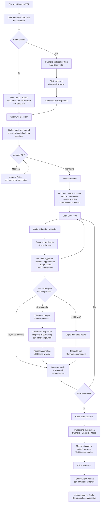
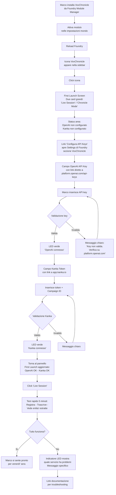
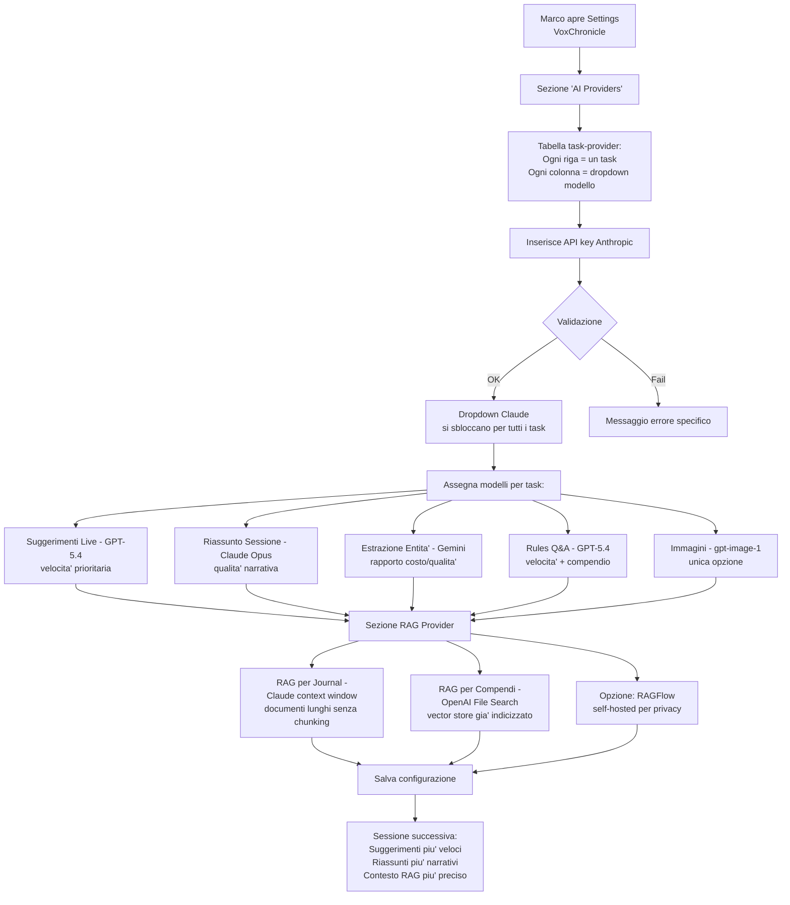
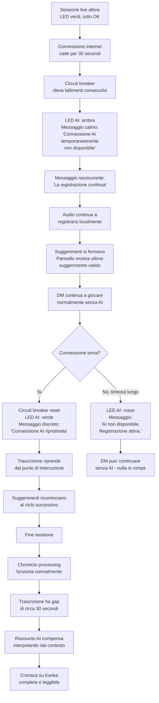
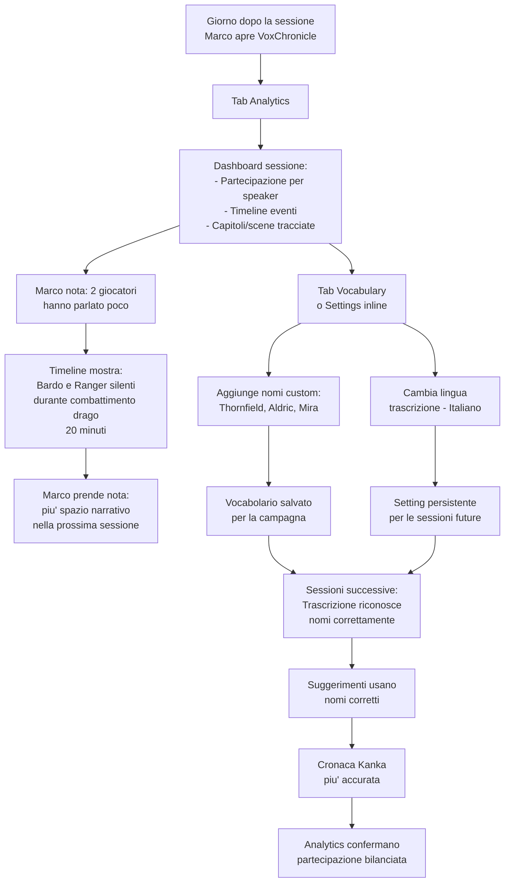

# UX Design Specification VoxChronicle

**Author:** Aiacos
**Date:** 2026-03-07

---

## Executive Summary

### Project Vision

VoxChronicle e' un compagno AI per il Dungeon Master di Foundry VTT che opera in due modalita': assistenza live durante il gioco e cronaca automatica post-sessione. L'esperienza UX si fonda su un principio chiave: il DM non deve essere interrotto. Il pannello prepara contesto e suggerimenti silenziosamente (Ambient Intelligence), il DM consulta quando vuole. A fine sessione, il workflow chronicle deve essere quasi one-click perche' il DM e' stanco e vuole risultati immediati di qualita' pubblicabile.

### Target Users

**Utente primario:** Dungeon Master di D&D 5e su Foundry VTT con sessioni settimanali di 3-4 ore.

**Profilo comportamentale:**
- Opera su monitor singolo con Foundry a schermo intero — lo spazio UI e' limitato e prezioso
- Durante il gioco e' sotto carico cognitivo alto — non vuole interruzioni, consulta il pannello on-demand
- Modifica le impostazioni frequentemente (journal, vocabolario, provider) — le settings non sono "set and forget"
- Processa la cronaca subito dopo la sessione, stanco — il workflow deve essere rapido con buoni default
- I giocatori leggono le cronache su Kanka — l'output deve essere di qualita' pubblicabile senza editing manuale
- Puo' usare un addon popup per spostare il pannello su una finestra separata

**Livelli di competenza:**
- Base: inserire API key, avviare sessione, pubblicare cronaca
- Intermedio: configurare journal, vocabolario, lingua trascrizione
- Avanzato: multi-provider AI, selezione modello per-task, RAG backend

### Key Design Challenges

1. **Spazio limitato su monitor singolo**: Il pannello floating compete con canvas, fogli PG, chat. Deve essere compatto, collassabile, e leggibile con un colpo d'occhio
2. **Ambient Intelligence, non interruzione**: I suggerimenti devono essere disponibili passivamente — niente popup o notifiche invasive durante il gioco
3. **Workflow post-sessione per utente stanco**: Chronicle processing deve essere quasi one-click con anteprima opzionale, non un processo multi-step faticoso
4. **Qualita' output pubblicabile**: Le cronache su Kanka sono lette dai giocatori — riassunti, entita' e immagini devono essere accurati e coerenti senza editing
5. **Settings ad accesso frequente**: Le configurazioni piu' usate devono essere raggiungibili rapidamente dal pannello, non sepolte nei menu di Foundry

### Design Opportunities

1. **Pannello contestuale adattivo**: Mostra contenuti diversi in base alla fase (live vs chronicle) senza richiedere tab switching manuale
2. **Quick-access settings inline**: Configurazioni frequenti (journal, lingua, provider) direttamente nel pannello come controlli inline
3. **Popup window compatibility**: Design che funziona sia embedded in Foundry sia in finestra popup separata — elimina il vincolo monitor singolo

## Core User Experience

### Defining Experience

L'esperienza core di VoxChronicle ruota attorno a un momento chiave: **il DM non ricorda un dettaglio della campagna e lo trova nel pannello in meno di 3 secondi**. Questo e' il momento che definisce il valore del prodotto — trasforma l'insicurezza narrativa in sicurezza improvvisativa.

Le due azioni piu' frequenti sono:
1. **Consultare suggerimenti contestuali** durante il gioco — il pannello mostra contesto rilevante basato su cio' che sta accadendo nella sessione
2. **Processare il riassunto** a fine sessione — one-click per generare e pubblicare la cronaca su Kanka

Tutto il resto (registrazione, trascrizione, estrazione entita', generazione immagini) deve essere invisibile — infrastruttura che lavora silenziosamente.

### Platform Strategy

- **Piattaforma**: Modulo browser-side per Foundry VTT v13, pannello floating ApplicationV2
- **Input primario**: Mouse/tastiera (desktop browser)
- **Layout**: Monitor singolo con Foundry a schermo intero — il pannello deve essere compatto e non occlusivo. Compatibile con addon popup per finestra separata
- **Offline**: Non supportato — richiede connessione per API AI e Kanka
- **Browser target**: Chrome/Edge (primario), Safari (secondario con fallback codec)
- **Vincolo critico**: Lo spazio UI e' condiviso con il canvas di gioco, fogli PG, chat, e altri moduli Foundry. Il pannello non puo' mai "rubare" attenzione

### Effortless Interactions

Tre interazioni devono essere completamente automatiche, senza intervento del DM:

1. **Contesto journal auto-aggiornato**: Il sistema carica e aggiorna il contesto RAG in base ai journal selezionati e alla scena corrente. Il DM non deve mai dire all'AI "guarda questo journal" — il contesto e' gia' pronto
2. **Cronaca progressiva**: La cronaca si costruisce durante la sessione, scena per scena. A fine sessione il riassunto e' gia' pronto — il DM preme "Pubblica" e trova tutto su Kanka
3. **Estrazione entita' automatica**: NPC, luoghi e oggetti vengono estratti dalla trascrizione e preparati per Kanka senza intervento. Il DM rivede solo se vuole, non perche' deve

Altre interazioni che devono essere frictionless:
- **Avvio sessione**: Un pulsante, nessuna configurazione pre-sessione
- **Rules Q&A**: Domanda naturale, risposta immediata con citazione del compendio
- **Speaker labeling**: Mappatura speaker persistente tra sessioni, non da rifare ogni volta

### Critical Success Moments

1. **"Ah, ecco!"** — Il DM non ricorda il nome del sindaco di Thornfield. Guarda il pannello, trova il dettaglio in <3 secondi. Improvvisa con sicurezza. Questo e' il momento make-or-break: se il suggerimento arriva tardi, e' generico, o e' sbagliato, il prodotto ha fallito
2. **"Wow, e' gia' fatto"** — Fine sessione, il DM preme "Pubblica". Il giorno dopo i giocatori trovano su Kanka un riassunto narrativo con entita' e immagini. Zero lavoro post-sessione
3. **"Funziona e basta"** — Prima sessione con VoxChronicle. Il DM apre il pannello, vede due opzioni chiare (Live / Chronicle), preme Start. Tutto parte. Nessun tutorial necessario
4. **"Non me ne sono accorto"** — La connessione internet cade per 30 secondi. Il DM non nota nulla — l'audio continua a registrarsi, i suggerimenti riprendono quando la connessione torna

### Experience Principles

1. **Invisibile finche' non serve**: VoxChronicle lavora silenziosamente in background. Il DM lo consulta quando vuole, non viene mai interrotto. L'AI prepara, non propone
2. **Risposta istantanea al bisogno**: Quando il DM ha bisogno di un'informazione, la trova in <3 secondi. La velocita' percepita e' piu' importante della completezza — meglio una risposta parziale immediata che una completa in ritardo
3. **Zero lavoro post-sessione**: La cronaca, le entita' e le immagini si costruiscono durante il gioco. A fine sessione il DM preme un pulsante, non fa un lavoro
4. **Chiaro al primo sguardo**: Ogni elemento UI comunica il suo scopo senza spiegazione. Due modalita' evidenti, stato del sistema sempre visibile, nessun menu nascosto per le azioni comuni

## Desired Emotional Response

### Primary Emotional Goals

1. **Sicurezza narrativa**: Il DM si sente supportato e sicuro durante il gioco. Non deve temere di dimenticare dettagli — sa che il pannello ha le risposte. Questa sicurezza gli permette di improvvisare con coraggio
2. **Stupore senza sforzo**: La cronaca pubblicata automaticamente sorprende il DM e i giocatori. "Non ho fatto nulla e il risultato e' questo?" — il valore percepito supera l'aspettativa
3. **Fiducia nel sistema**: Il DM si fida che VoxChronicle funziona silenziosamente in background. Non controlla se sta registrando, non si preoccupa di errori. Come un assistente discreto al tavolo

### Emotional Journey Mapping

| Fase | Emozione Target | Anti-emozione da Evitare |
|------|----------------|-------------------------|
| **Primo avvio** | Chiarezza — "Capisco subito cosa fare" | Confusione — "Non so da dove iniziare" |
| **Setup API keys** | Fiducia — "I miei dati sono al sicuro" | Ansia — "Dove vanno le mie credenziali?" |
| **Avvio sessione live** | Anticipazione — "Vediamo cosa mi suggerisce" | Frustrazione — "Troppe opzioni da configurare" |
| **Durante il gioco** | Sicurezza — "Ho il contesto a portata di mano" | Ansia — "L'AI sta giudicando il mio gioco" |
| **Consultazione suggerimento** | Sorpresa positiva — "Esatto, era proprio questo!" | Delusione — "Suggerimento generico/inutile" |
| **Rules Q&A** | Efficienza — "Trovato in 2 secondi" | Frustrazione — "Risposta lenta o imprecisa" |
| **Errore/disconnessione** | Tranquillita' — "Il sistema gestisce, non perdo nulla" | Panico — "Ho perso la registrazione!" |
| **Fine sessione** | Sollievo — "Premo un pulsante e ho finito" | Fatica — "Devo ancora lavorarci sopra" |
| **Cronaca pubblicata** | Orgoglio — "I giocatori saranno entusiasti" | Imbarazzo — "Devo correggere tutto prima di condividere" |
| **Sessione successiva** | Fiducia — "Funzionera' come l'ultima volta" | Dubbio — "Chissa' se oggi funziona" |

### Micro-Emotions

**Emozioni da coltivare:**
- **Controllo senza sforzo**: Il DM sente di avere il controllo sull'AI, non il contrario. L'AI e' uno strumento, non un giudice
- **Competenza amplificata**: VoxChronicle non sostituisce il DM, lo rende migliore. Il DM si sente piu' competente, non dipendente
- **Gratificazione condivisa**: La cronaca su Kanka diventa un momento di orgoglio condiviso con i giocatori — "guardate cos'ha fatto la nostra sessione"
- **Affidabilita' silenziosa**: La sensazione che tutto funziona senza doverci pensare, come l'illuminazione in una stanza

**Emozioni da eliminare:**
- **Ansia da sorveglianza**: Il DM non deve mai sentire che l'AI "ascolta e giudica" il suo stile di gioco
- **Frustrazione da ritardo**: Un suggerimento in ritardo e' peggio di nessun suggerimento — genera frustrazione e sfiducia
- **Confusione da complessita'**: Troppe opzioni visibili contemporaneamente creano paralisi decisionale
- **Panico da perdita dati**: La registrazione audio non deve mai essere a rischio — il DM deve sapere che e' al sicuro

### Design Implications

| Emozione Target | Implicazione UX |
|----------------|-----------------|
| **Sicurezza narrativa** | Suggerimenti sempre visibili nel pannello, mai nascosti. Contenuto aggiornato silenziosamente senza azione del DM |
| **Stupore senza sforzo** | Cronaca con qualita' editoriale di default. Immagini generate automaticamente per le scene salienti |
| **Fiducia nel sistema** | Indicatori di stato discreti ma sempre visibili (pallino verde = tutto ok). Nessun messaggio allarmante per errori recuperabili |
| **Controllo senza sforzo** | Il DM puo' sempre sovrascrivere, escludere, modificare. L'AI suggerisce, il DM decide |
| **Tranquillita' durante errori** | Messaggi di errore calmi e informativi: "Connessione temporaneamente non disponibile — la registrazione continua". Mai "ERRORE CRITICO" |
| **Chiarezza al primo uso** | Due modalita' grandi e chiare (Live / Chronicle). Nessun onboarding wizard — l'interfaccia si spiega da sola |

### Emotional Design Principles

1. **L'AI e' un alleato discreto, non un protagonista**: VoxChronicle non attira mai l'attenzione su di se'. Il protagonista e' il DM e la sua storia. L'AI lavora dietro le quinte
2. **Calma sotto pressione**: Quando qualcosa va storto, il sistema comunica tranquillita'. Indicatori di stato con colori neutri (giallo, non rosso). Messaggi rassicuranti ("La registrazione continua") prima del problema ("connessione non disponibile")
3. **Orgoglio nel risultato**: L'output (cronaca, entita', immagini) deve essere di qualita' tale che il DM sia orgoglioso di condividerlo. Un risultato mediocre genera imbarazzo e abbandono
4. **Competenza, non dipendenza**: Il DM deve sentirsi piu' bravo grazie a VoxChronicle, non dipendente da esso. Se l'AI non funziona, il DM continua a giocare normalmente — perde un supporto, non una necessita'

## UX Pattern Analysis & Inspiration

### Inspiring Products Analysis

#### D&D Beyond
- **Cosa fa bene**: Ricerca regole istantanea — digiti, trovi. Nessun caricamento percepibile. Le informazioni sono organizzate per contesto d'uso (combattimento, incantesimi, mostri), non per struttura del manuale
- **Pattern chiave**: Search-first UX — l'informazione arriva prima del bisogno di navigare. Schede compatte con espansione on-demand. UI densa ma leggibile
- **Perche' funziona**: Un DM durante il gioco ha 5 secondi per trovare una regola. D&D Beyond rispetta questo vincolo temporale
- **Lezione per VoxChronicle**: La Rules Q&A e i suggerimenti contestuali devono avere la stessa immediatezza. Risultati visibili senza click extra, espandibili per dettagli

#### Discord
- **Cosa fa bene**: Interazione fluida e veloce. I messaggi appaiono istantaneamente, le notifiche sono chiare senza essere invasive, il cambio canale e' immediato
- **Pattern chiave**: Real-time senza friction — lo stato si aggiorna live senza refresh. UI compatta con sidebar navigabile. Indicatori di stato discreti (pallino verde/giallo/rosso)
- **Perche' funziona**: L'utente non pensa mai "sto aspettando". Il feedback e' immediato per ogni azione
- **Lezione per VoxChronicle**: Lo streaming dei suggerimenti deve avere la stessa fluidita'. Gli indicatori di stato (registrazione, connessione AI, trascrizione) devono seguire lo stesso pattern discreto di Discord

### Transferable UX Patterns

**Pattern di Navigazione:**
- **Tab compatti con contenuto denso** (D&D Beyond) — informazione massima in spazio minimo, perfetto per il pannello floating su monitor singolo
- **Sidebar collassabile** (Discord) — il pannello VoxChronicle deve potersi ridurre a una barra minima senza perdere gli indicatori di stato

**Pattern di Interazione:**
- **Search-first per regole** (D&D Beyond) — la Rules Q&A deve funzionare come una search bar: digita domanda, ottieni risposta immediata con streaming
- **Real-time update senza refresh** (Discord) — i suggerimenti e la trascrizione devono aggiornarsi nel pannello senza re-render, come i messaggi in Discord
- **Feedback immediato per ogni azione** (Discord) — ogni click produce un risultato visibile entro 100ms (anche solo un indicatore di caricamento)

**Pattern Visivi:**
- **Indicatori di stato con pallini colorati** (Discord) — stato connessione AI, registrazione, trascrizione come pallini verde/giallo/rosso discreti nell'header del pannello
- **Densita' informativa controllata** (D&D Beyond) — mostra il minimo necessario, espandi on-demand. I suggerimenti mostrano 2-3 righe, click per dettaglio completo

### Anti-Patterns to Avoid

1. **Blocco e non risposta**: L'interfaccia non deve mai "freezare" durante operazioni AI. Tutte le chiamate API sono asincrone con feedback visivo immediato (spinner, skeleton, streaming)
2. **Comportamento inatteso**: Ogni pulsante fa esattamente quello che dice. "Start Live Session" avvia la sessione live, non apre un dialog di configurazione. Nessuna azione nascosta o side-effect non comunicato
3. **Bug visibili e stato inconsistente**: Lo stato del pannello deve sempre riflettere la realta'. Se la registrazione e' attiva, l'indicatore e' attivo. Se l'AI non risponde, l'indicatore lo mostra. Mai uno stato "frozen" che non corrisponde a cosa sta succedendo
4. **Disintegrazione dalla piattaforma host**: VoxChronicle deve sentirsi parte di Foundry VTT, non un corpo estraneo. Stesso stile CSS, stessi pattern di interazione (ApplicationV2), stessi dialog. L'utente non deve sentire di usare "un altro software"
5. **Promesse non mantenute**: Se un pulsante dice "Pubblica su Kanka", deve pubblicare su Kanka. Se un suggerimento dice "basato sui tuoi journal", deve effettivamente usare i journal selezionati. La fiducia si rompe con una sola promessa tradita

### Design Inspiration Strategy

**Da adottare direttamente:**
- Indicatori di stato stile Discord (pallini colorati nell'header)
- Aggiornamento real-time senza refresh (suggerimenti, trascrizione)
- Feedback immediato per ogni azione (<100ms risposta visiva)

**Da adattare al contesto VoxChronicle:**
- Search-first di D&D Beyond -> adattato a Rules Q&A con input naturale (domanda in linguaggio libero, non keyword search)
- Tab compatti di D&D Beyond -> adattato a pannello floating con tab contestuali che cambiano in base alla fase (live vs chronicle)
- Densita' informativa -> adattata al contesto "colpo d'occhio durante il gioco" — meno densa di D&D Beyond, piu' focalizzata sul contesto corrente

**Da evitare assolutamente:**
- UI che si blocca durante operazioni lunghe (anti-pattern da molti moduli Foundry)
- Comportamenti diversi da quelli comunicati dai label dei pulsanti
- Stile visivo che "stona" con il tema di Foundry VTT
- Overlay o popup che coprono il canvas di gioco durante la sessione live

## Design System Foundation

### Design System Choice

**Foundry-Native + Design Tokens Custom VoxChronicle**

VoxChronicle adotta il design system nativo di Foundry VTT v13 come base, esteso con un set strutturato di design tokens custom per garantire consistenza interna senza perdere l'integrazione visiva con la piattaforma host.

### Rationale for Selection

1. **Integrazione nativa obbligatoria**: VoxChronicle e' un modulo embedded in Foundry VTT, non un'app standalone. L'utente deve percepirlo come parte del sistema, non come un corpo estraneo. Usare il design system di Foundry garantisce coerenza visiva automatica
2. **Zero dipendenze esterne**: Nessun framework CSS (Tailwind, MUI) che potrebbe confliggere con gli stili di Foundry o di altri moduli. Il CSS e' vanilla con namespace `.vox-chronicle`
3. **Theming automatico**: Foundry supporta temi (light/dark, moduli tematici). Usando le variabili CSS di Foundry, VoxChronicle si adatta automaticamente al tema scelto dall'utente
4. **Mantenibilita' per sviluppatore solo**: Un set contenuto di design tokens custom e' piu' facile da mantenere di un framework esterno. Meno decisioni, piu' consistenza
5. **Brownfield**: Il progetto ha gia' `vox-chronicle.css` con stili definiti — i design tokens strutturano e normalizzano l'esistente senza riscrittura completa

### Implementation Approach

**Layer 1 — Foundry Base Variables (ereditati, non ridefiniti):**
- Colori testo: `--color-text-light-primary`, `--color-text-dark-primary`
- Colori sfondo: `--color-bg-option`, `--color-border-light`
- Font: `--font-primary`, `--font-size-base`
- Ombre e bordi: pattern standard Foundry ApplicationV2

**Layer 2 — VoxChronicle Design Tokens (custom, namespaced):**
- `--vox-color-accent`: Colore accent per azioni primarie e elementi attivi
- `--vox-color-success`, `--vox-color-warning`, `--vox-color-error`: Stato sistema (pallini Discord-style)
- `--vox-color-ai-suggestion`: Sfondo distinto per contenuto generato dall'AI
- `--vox-spacing-xs/sm/md/lg/xl`: Scala spacing consistente per il pannello compatto
- `--vox-panel-width-compact`, `--vox-panel-width-expanded`: Dimensioni pannello
- `--vox-transition-fast`, `--vox-transition-normal`: Animazioni consistenti
- `--vox-font-size-compact`: Dimensione testo ridotta per densita' informativa nel pannello

**Layer 3 — Component Tokens (derivati dai layer 1+2):**
- `--vox-tab-height`, `--vox-tab-active-border`: Tab del pannello
- `--vox-status-dot-size`: Indicatori di stato
- `--vox-suggestion-card-padding`: Card suggerimenti AI
- `--vox-streaming-text-color`: Testo in streaming (differenziato dal testo statico)

### Customization Strategy

- **CSS custom properties** dichiarate in `:root` dentro `vox-chronicle.css` con fallback alle variabili Foundry
- **Namespace BEM**: Tutte le classi seguono `.vox-chronicle-{component}__{element}--{modifier}`
- **Nessun `!important`**: I token custom hanno specificita' sufficiente grazie al namespace senza forzature
- **Compatibilita' temi Foundry**: Ogni token custom ha un fallback alla variabile Foundry equivalente: `var(--vox-color-accent, var(--color-border-highlight))`
- **Dark mode**: Supportato automaticamente tramite le variabili Foundry ereditate. I token custom che definiscono colori specifici usano `prefers-color-scheme` o classi Foundry per varianti dark

## Defining Core Interaction

### Defining Experience

**"Un assistente AI che ti sussurra i dettagli della tua campagna mentre giochi, e a fine sessione pubblica tutto su Kanka da solo."**

L'interazione che definisce VoxChronicle e': il DM guarda il pannello e trova il contesto di cui ha bisogno — senza averlo chiesto. Se non basta, digita una domanda e riceve la risposta in <3 secondi. Il pannello e' una finestra sulla memoria della campagna che il DM non ha.

### User Mental Model

**Come il DM risolve il problema oggi (senza VoxChronicle):**
- Sfoglia il manuale fisico cercando la regola — interrompe il flusso di gioco per 30-60 secondi
- Apre i journal di Foundry e naviga tra le pagine — perde il contatto visivo con i giocatori
- Improvvisa quando non ricorda — rischia inconsistenze narrative che i giocatori notano

**Modello mentale atteso:**
- Il DM si aspetta di trovare l'informazione "a portata di mano" come se avesse appunti perfetti sempre aggiornati
- Non vuole cercare — vuole trovare. La differenza e' cruciale: cercare e' un'azione, trovare e' un risultato
- Si aspetta che il sistema "sappia" di cosa si sta parlando al tavolo, perche' sta ascoltando

**Gap da colmare:**
- Da "cerco nel manuale/journal" a "guardo il pannello e c'e'"
- Da "improvviso e spero" a "improvviso con sicurezza"
- Da "prendo appunti dopo la sessione" a "la cronaca e' gia' pronta"

### Success Criteria

1. **Il DM trova l'informazione senza cercarla**: Il pannello mostra contesto rilevante alla conversazione in corso. Il DM guarda e trova — zero azioni richieste
2. **Domanda specifica -> risposta in <3 secondi**: Quando il contesto passivo non basta, il DM digita una domanda e il primo token della risposta appare entro 1 secondo (streaming)
3. **L'informazione e' corretta e specifica**: Il suggerimento menziona NPC, luoghi e eventi specifici della campagna — non consigli generici di D&D
4. **Il DM torna al gioco in <5 secondi**: L'intero ciclo (guardo pannello -> trovo/chiedo -> torno ai giocatori) deve durare meno di 5 secondi
5. **A fine sessione, un click**: Il DM preme "Pubblica", la cronaca va su Kanka. Non deve revisionare, non deve formattare, non deve caricare immagini manualmente

### Novel UX Patterns

**Pattern ibrido: Ambient Context + Active Query**

Questo pattern combina due modalita' in uno spazio unico:

- **Modalita' passiva (Ambient Context)**: Il pannello mostra sempre il contesto corrente — ultimo suggerimento, scena rilevata, NPC menzionati, dettagli dalla knowledge base. Si aggiorna silenziosamente ad ogni ciclo di trascrizione. Il DM lo consulta con un colpo d'occhio
- **Modalita' attiva (Active Query)**: Un campo di input "Chiedi qualcosa..." nella parte inferiore del pannello. Il DM digita una domanda in linguaggio naturale ("Cosa aveva promesso Aldric?") e riceve risposta in streaming con citazione dei journal

**Perche' e' innovativo nel contesto TTRPG:**
- Nessun modulo Foundry offre contesto passivo basato su trascrizione live
- La combinazione passivo+attivo elimina il bisogno di decidere "devo cercare o aspetto?" — entrambe le opzioni sono sempre disponibili
- Il pattern e' familiare (chat + feed) ma applicato a un contesto nuovo (assistenza DM real-time)

**Pattern familiari riutilizzati:**
- Feed di suggerimenti -> simile a una chat Discord (familiare)
- Campo domanda -> simile a search bar D&D Beyond (familiare)
- Indicatori di stato -> pallini colorati Discord (familiare)
- Tab switching -> pattern standard Foundry ApplicationV2 (nativo)

### Experience Mechanics

**1. Initiation — Avvio sessione live:**
- Il DM clicca "Start Live Session" nel pannello
- Il sistema chiede conferma dei journal da usare come contesto (pre-selezionati dall'ultima sessione)
- Un click avvia registrazione + trascrizione + contesto AI
- Indicatore verde nell'header: "Sessione attiva"

**2. Interaction — Ciclo live (ogni ~30 secondi):**
- **Automatico**: Audio catturato -> trascritto -> analizzato -> contesto aggiornato nel pannello
- **Pannello Ambient**: Mostra l'ultimo suggerimento contestuale (2-3 righe), la scena corrente (combattimento/sociale/esplorazione), e gli NPC/luoghi menzionati di recente
- **Query attiva**: Il DM digita nel campo "Chiedi qualcosa..." -> risposta in streaming con citazione journal -> il campo si svuota, la risposta resta visibile come ultimo suggerimento
- **Rules Q&A**: Stesso campo di input, il sistema distingue automaticamente tra domanda di contesto e domanda di regole

**3. Feedback — Segnali di funzionamento:**
- Pallino verde pulsante nell'header = registrazione attiva
- Pallino verde fisso = connessione AI ok
- Testo suggerimento che appare in streaming = l'AI sta lavorando
- Badge "Scena: Combattimento" aggiornato = il sistema capisce cosa sta succedendo
- Pallino giallo = connessione AI temporaneamente non disponibile (registrazione continua)

**4. Completion — Fine sessione:**
- Il DM clicca "Stop Session"
- Il pannello passa automaticamente alla vista Chronicle
- Mostra: riassunto narrativo (gia' costruito durante la sessione), entita' estratte, immagini generate
- Un pulsante prominente: "Pubblica su Kanka"
- Click -> pubblicazione -> link alla cronaca su Kanka

## Visual Design Foundation

### Color System

**Identita' visiva: Modern Tech Assistant**

VoxChronicle ha un'estetica moderna e tecnologica — un "mission control" discreto per il DM. Non tenta di sembrare medievale o fantasy, ma uno strumento AI sofisticato che lavora al servizio della narrazione.

**Palette principale (derivata da Foundry + accent custom):**

| Token | Ruolo | Valore indicativo | Note |
|-------|-------|-------------------|------|
| `--vox-color-accent` | Azioni primarie, tab attivo, focus | `#4a9eff` (blu tech) | Contrasto AAA su sfondo scuro Foundry |
| `--vox-color-accent-hover` | Hover su elementi accent | `#6ab4ff` | Versione piu' chiara per hover |
| `--vox-color-accent-muted` | Sfondo elementi accent soft | `rgba(74, 158, 255, 0.12)` | Per card e aree highlight |

**Colori di stato (LED/spie system):**

| Token | Stato | Valore | Uso |
|-------|-------|--------|-----|
| `--vox-led-active` | Attivo/OK | `#22c55e` (verde) | Registrazione attiva, connessione AI ok |
| `--vox-led-active-pulse` | Attivo pulsante | `#22c55e` con animazione pulse | Registrazione in corso (LED che pulsa) |
| `--vox-led-warning` | Attenzione | `#f59e0b` (ambra) | Connessione instabile, retry in corso |
| `--vox-led-error` | Errore | `#ef4444` (rosso) | Disconnesso, errore critico |
| `--vox-led-idle` | Inattivo | `#6b7280` (grigio) | Servizio non attivo |
| `--vox-led-streaming` | AI in streaming | `#8b5cf6` (viola) | Token in arrivo dall'AI |

**Colori semantici:**

| Token | Ruolo | Valore |
|-------|-------|--------|
| `--vox-color-ai-bg` | Sfondo card suggerimento AI | `rgba(139, 92, 246, 0.08)` — tinta viola leggera |
| `--vox-color-ai-border` | Bordo card suggerimento AI | `rgba(139, 92, 246, 0.25)` |
| `--vox-color-scene-combat` | Badge scena combattimento | `#ef4444` (rosso) |
| `--vox-color-scene-social` | Badge scena sociale | `#3b82f6` (blu) |
| `--vox-color-scene-exploration` | Badge scena esplorazione | `#22c55e` (verde) |
| `--vox-color-scene-rest` | Badge scena riposo | `#f59e0b` (ambra) |

### Typography System

**Strategia: Ereditare da Foundry, specializzare per il pannello**

VoxChronicle usa i font di Foundry VTT come base per integrazione nativa. Definisce token custom solo per esigenze specifiche del pannello compatto.

**Gerarchia tipografica:**

| Livello | Token | Dimensione | Uso |
|---------|-------|-----------|-----|
| Titolo pannello | `--vox-font-title` | `14px` / `font-weight: 600` | Header del pannello, nome sessione |
| Titolo tab | `--vox-font-tab` | `12px` / `font-weight: 500` | Label dei tab |
| Body | `--vox-font-body` | `13px` / `font-weight: 400` | Testo suggerimenti, trascrizione |
| Body compatto | `--vox-font-compact` | `11px` / `font-weight: 400` | Metadata, timestamp, speaker label |
| Badge/LED label | `--vox-font-badge` | `10px` / `font-weight: 600` / `text-transform: uppercase` | "Scena: Combattimento", stati |
| Input | `--vox-font-input` | `13px` / `font-weight: 400` | Campo "Chiedi qualcosa..." |

**Testo AI in streaming:**
- Font monospace leggero per il testo che sta arrivando token-per-token: `--vox-font-streaming`
- Cursore lampeggiante a fine testo (animazione CSS, non blinking reale — rispetta WCAG)
- Transizione a font body normale quando lo streaming e' completo

### Spacing & Layout Foundation

**Strategia: Arioso con tab contestuali**

Il pannello privilegia la leggibilita' e la chiarezza visiva rispetto alla densita'. Ogni tab mostra solo il contenuto rilevante alla fase corrente, evitando sovraccarico informativo.

**Scala spacing (base 4px):**

| Token | Valore | Uso |
|-------|--------|-----|
| `--vox-space-xs` | `4px` | Gap tra LED e label, padding badge |
| `--vox-space-sm` | `8px` | Padding interno card, gap tra elementi in linea |
| `--vox-space-md` | `12px` | Margin tra sezioni, padding tab content |
| `--vox-space-lg` | `16px` | Separazione tra card suggerimento, gap tra tab e contenuto |
| `--vox-space-xl` | `24px` | Margin tra aree funzionali principali |

**Layout pannello:**

- **Header fisso**: Titolo sessione + indicatori LED di stato (registrazione, AI, trascrizione) + timer sessione. Sempre visibile, mai scrollabile
- **Tab bar**: Tab contestuali che cambiano in base alla fase. Durante Live: [Assistente | Regole | Trascrizione]. Dopo Stop: [Cronaca | Entita' | Immagini]. Tab "Analytics" e "Settings" sempre disponibili come icone secondarie
- **Content area scrollabile**: Area principale con contenuto del tab attivo. Scroll verticale con scrollbar custom sottile
- **Input bar fisso (bottom)**: Campo "Chiedi qualcosa..." sempre visibile in basso durante Live mode. Scompare in Chronicle mode

**Indicatori visivi — sistema LED/barre:**

- **LED di stato nell'header**: Pallini 8px con glow effect — verde pulsante (registrazione), verde fisso (AI ok), viola pulsante (streaming in corso), ambra (warning), rosso (errore)
- **Barra progresso**: Barra sottile (2px) sotto l'header che mostra il progresso del ciclo live (fill da sinistra a destra ogni ~30s) o il progresso del processing chronicle
- **Barra livello audio**: Mini barra verticale (VU meter, 3 barre) nell'header che pulsa con il volume del microfono — feedback visivo immediato che il microfono sta catturando

### Accessibility Considerations

- **Contrasto colori**: Tutti i colori testo rispettano WCAG 2.1 AAA (7:1) nei limiti di Foundry VTT. I colori LED hanno anche label testuale per non affidarsi solo al colore
- **LED + label**: Ogni indicatore LED ha una label testuale associata (tooltip o testo adiacente) — il colore non e' l'unico veicolo di informazione
- **Focus ring**: Ring di focus custom `2px solid var(--vox-color-accent)` con `outline-offset: 2px` per visibilita' chiara
- **Animazioni rispettose**: `prefers-reduced-motion: reduce` disabilita le animazioni pulse dei LED e le transizioni, mantenendo solo i cambi di stato istantanei
- **Zoom 200%**: Il layout flex del pannello si adatta al ridimensionamento. I token spacing sono in `px` fissi ma il pannello e' ridimensionabile dall'utente
- **Aria labels**: Ogni LED ha `aria-label` descrittivo ("Registrazione attiva", "Connessione AI: ok")

## Design Direction Decision

### Direzione Scelta

**Pannello Collassabile Adattivo (C+D+E)** — Combinazione di tre direzioni per fasi d'uso diverse:

- **Direction E (First Launch)**: Schermata auto-esplicativa con due card grandi (Live Session / Chronicle Mode) e stato API. Appare solo al primo avvio o quando nessuna sessione e' attiva
- **Direction C (Live Mode)**: Pannello collassabile 48px→320px con LED sempre visibili. Lo stato collassato mostra solo gli indicatori (REC verde pulsante, AI verde fisso, Streaming viola). Espansione con click per accedere a suggerimenti, query, regole
- **Direction D (Chronicle Mode)**: Transizione automatica dopo Stop Session. Mostra riassunto narrativo, entita' estratte, preview immagini, pulsante "Pubblica su Kanka"

### Design Rationale

1. **Rispetto dello spazio schermo**: 48px collassato e' quasi invisibile su monitor singolo — il canvas di Foundry resta libero durante il gioco
2. **Ambient intelligence tramite LED**: Anche collassato, il DM vede a colpo d'occhio se tutto funziona (verde), se c'e' un problema (ambra/rosso), o se l'AI sta elaborando (viola)
3. **Zero azioni per la transizione**: Il passaggio Live→Chronicle e' automatico al click di "Stop Session" — il pannello si adatta senza navigazione manuale
4. **First Launch come onboarding implicito**: Le due card grandi eliminano il bisogno di tutorial — l'interfaccia si spiega da sola
5. **Badge notifications su icone**: Anche collassato, badge numerici sulle icone tab segnalano nuovi suggerimenti o entita' estratte — ambient intelligence senza interruzione

### Technical Implementation Approach

- **CSS transitions** per l'animazione di espansione/collasso (width 48px↔320px, 300ms ease)
- **LED system** con pseudo-elementi CSS e animazione `pulse` keyframe
- **Badge notifications** con CSS `::after` counter sui bottoni tab
- **State persistence** via `localStorage` per ricordare stato collassato/espanso tra sessioni
- **Transizione automatica** Live→Chronicle gestita da `SessionOrchestrator` che emette evento di cambio fase

## User Journey Flows

### Journey 1: Sessione Live (Happy Path)

Il DM apre Foundry, clicca l'icona VoxChronicle. Se e' il primo avvio, vede la First Launch Screen con due card (Live/Chronicle) e stato API. Altrimenti vede il pannello collassato a 48px con LED grigi.



**Entry point:** Icona sidebar Foundry o pannello collassato
**Decisioni chiave:** Conferma journal, query attiva vs passiva, fine sessione
**Feedback:** LED system completo, VU meter, badge scena, streaming viola
**Successo:** Cronaca su Kanka pronta senza editing

### Journey 2: Primo Setup

Il DM installa VoxChronicle per la prima volta. Il flusso e' lineare e guidato — nessuna decisione complessa.



**Entry point:** Installazione modulo Foundry
**Feedback:** Validazione API key immediata, LED per stato connessione
**Recovery:** Messaggi di errore specifici con link diretti alla soluzione
**Successo:** Test di 5 minuti conferma tutto funzionante

### Journey 3: Configurazione Multi-Provider

Il DM avanzato configura modelli AI diversi per ogni task, ottimizzando velocita', qualita' e costo.



**Entry point:** Settings di Foundry sezione VoxChronicle
**Decisioni chiave:** Quale modello per quale task (trade-off velocita'/qualita'/costo)
**Feedback:** Dropdown si sbloccano con validazione key, hint su ogni scelta
**Successo:** Sessione migliorata con modelli ottimali per ogni funzione

### Journey 4: Sessione Problematica (Recovery)

Il sistema gestisce disconnessioni e errori senza intervento del DM. Principio chiave: rassicurare prima, informare poi.



**Feedback:** LED ambra con messaggio calmo, mai "ERRORE CRITICO"
**Recovery:** Automatica — circuit breaker reset, ripresa trascrizione
**Principio:** "La registrazione continua" — prima rassicurare, poi informare
**Successo:** Cronaca finale completa nonostante l'interruzione

### Journey 5: Analisi e Ottimizzazione

Il DM usa analytics e vocabolario per migliorare sessioni successive — loop di miglioramento continuo.



**Entry point:** Pannello VoxChronicle il giorno dopo la sessione
**Feedback:** Dati visivi immediati, miglioramento misurabile nelle sessioni successive
**Successo:** Trascrizione accurata, partecipazione bilanciata

### Journey Patterns

Attraverso i 5 flussi emergono pattern ricorrenti standardizzabili:

**Pattern di navigazione:**
- **Entry point unico**: Tutto parte dall'icona sidebar o dal pannello collassato — un solo punto di ingresso per tutte le funzionalita'
- **Contestualita' automatica**: Il pannello mostra contenuti diversi in base alla fase (First Launch → Live → Chronicle → Analytics) senza navigazione manuale
- **Settings raggiungibili da due vie**: Sia da Foundry Settings sia da link inline nel pannello

**Pattern di decisione:**
- **Default intelligenti**: Journal pre-selezionati, provider pre-configurato, lingua auto-rilevata. Il DM conferma, non configura
- **Progressive disclosure**: Primo avvio mostra 2 opzioni. Configurazione avanzata disponibile ma non obbligatoria
- **Feedback before commit**: Validazione API key prima di salvare, preview cronaca prima di pubblicare

**Pattern di feedback:**
- **LED system unificato**: Stesso linguaggio visivo (verde/ambra/rosso/viola/grigio) in tutti i journey e tutte le fasi
- **Rassicurazione prima dell'informazione**: "La registrazione continua" → poi "connessione non disponibile". Mai allarmismo
- **Streaming come feedback attivo**: Il testo che appare token-per-token conferma che l'AI sta lavorando — il LED viola rinforza visivamente

### Flow Optimization Principles

1. **Minimo click al valore**: Sessione live = 2 click (icona + Start). Chronicle = 1 click (Pubblica). Setup = inserisci key e funziona
2. **Carico cognitivo ridotto per fase**: Mai piu' di 3-4 elementi interattivi visibili contemporaneamente nel pannello
3. **Recovery silenziosa**: L'utente non deve fare nulla per recuperare da errori — il sistema gestisce e informa con calma
4. **Momenti di piacere nel risultato**: La cronaca su Kanka e' il "wow moment" — qualita' pubblicabile senza sforzo
5. **Apprendimento progressivo**: Dal primo avvio (2 card) alla configurazione multi-provider (tabella task/model) — complessita' che emerge solo quando l'utente e' pronto

## Component Strategy

### Design System Components (Foundry VTT v13)

Componenti ereditati da Foundry ApplicationV2 senza personalizzazione:

| Componente | Uso in VoxChronicle |
|------------|-------------------|
| **Window frame** | Barra titolo, drag, resize, close — ereditato dal pannello ApplicationV2 |
| **Dialog** | Conferme (journal picker, pubblicazione Kanka), prompt |
| **Form elements** | Input, select, checkbox, range slider — per Settings |
| **Tab system** | Tab navigation nativa — base per i tab contestuali Live/Chronicle |
| **Notification system** | `ui.notifications.info/warn/error` — feedback fuori dal pannello |
| **Context menu** | Menu contestuale right-click — azioni secondarie |
| **Scrollbar styling** | Scrollbar Foundry-native sottile — per content area |

### Custom Components

#### LED Status Indicator

**Scopo:** Mostrare lo stato dei servizi (registrazione, AI, streaming) con feedback visivo immediato
**Contenuto:** Pallino colorato (8px) con glow effect + label testuale opzionale + tooltip
**Stati:**

| Stato | Token | Aspetto | Significato |
|-------|-------|---------|-------------|
| `active` | `--vox-led-active` | Verde fisso | Servizio connesso e funzionante |
| `active-pulse` | `--vox-led-active-pulse` | Verde pulsante | Registrazione in corso |
| `warning` | `--vox-led-warning` | Ambra fisso | Connessione instabile, retry |
| `error` | `--vox-led-error` | Rosso fisso | Disconnesso, errore critico |
| `streaming` | `--vox-led-streaming` | Viola pulsante | Token AI in arrivo |
| `idle` | `--vox-led-idle` | Grigio fisso | Servizio non attivo |

**Varianti:** Con label (pannello expanded), solo pallino (pannello collapsed), con glow effect (stati attivi)
**Accessibilita':** `aria-label` descrittivo per ogni stato, colore mai unico veicolo di informazione
**CSS:** `.vox-chronicle-led`, `.vox-chronicle-led--active`, `.vox-chronicle-led--pulse`

#### Collapsible Panel Shell

**Scopo:** Container principale che gestisce i 3 stati del pannello
**Contenuto:** Header con LED + area tab + content area scrollabile + input bar fissa

| Stato | Larghezza | Contenuto visibile |
|-------|-----------|-------------------|
| `collapsed` | 48px | Solo LED indicatori + icone tab verticali |
| `expanded` | 320px | Header completo + tab + contenuto + input bar |
| `first-launch` | 320px | Due card grandi (Live/Chronicle) + stato API |

**Azioni:** Expand/collapse con click su barra o doppio-click, pulsante toggle dedicato
**Transizione:** CSS `width` transition 300ms ease, `overflow: hidden` durante transizione
**Persistenza:** Stato salvato in `localStorage` — ricorda preferenza tra sessioni
**CSS:** `.vox-chronicle-panel`, `.vox-chronicle-panel--collapsed`, `.vox-chronicle-panel--expanded`

#### Suggestion Card

**Scopo:** Mostrare suggerimenti AI contestuali nel pannello live
**Contenuto:** Testo suggerimento (2-3 righe preview) + badge scena + NPC menzionati + timestamp

| Stato | Aspetto | Comportamento |
|-------|---------|---------------|
| `streaming` | Testo appare token-per-token, cursore lampeggiante, sfondo `--vox-color-ai-bg` | `aria-live="polite"`, LED viola |
| `complete` | Testo statico completo, sfondo ai-bg | Click per espandere dettagli con citazioni journal |
| `stale` | Opacita' ridotta (0.6), timestamp vecchio | Sostituito al prossimo ciclo |

**Varianti:** Compatta (2 righe, pannello expanded), espansa (dettaglio completo con citazioni)
**Accessibilita':** `aria-live="polite"` per screen reader, testo selezionabile e copiabile
**CSS:** `.vox-chronicle-suggestion`, `.vox-chronicle-suggestion--streaming`, `.vox-chronicle-suggestion__text`

#### Query Input Bar

**Scopo:** Campo per domande in linguaggio naturale (contesto campagna + regole)
**Contenuto:** Input text con placeholder "Chiedi qualcosa..." + pulsante invio
**Posizione:** Fissa in basso nel pannello durante Live mode, nascosta in Chronicle mode

| Stato | Aspetto |
|-------|---------|
| `idle` | Placeholder visibile, bordo neutro |
| `focused` | Bordo `--vox-color-accent`, placeholder scompare |
| `loading` | Spinner discreto nel pulsante invio |
| `disabled` | Grigio, non interagibile (chronicle mode) |

**Comportamento:** Enter per inviare, risposta appare come Suggestion Card in streaming. Il sistema distingue automaticamente tra domanda di contesto e domanda di regole
**Accessibilita':** `aria-label="Chiedi qualcosa sulla campagna o sulle regole"`, supporto tastiera completo
**CSS:** `.vox-chronicle-query`, `.vox-chronicle-query__input`, `.vox-chronicle-query__submit`

#### Scene Badge

**Scopo:** Indicare il tipo di scena corrente rilevato dall'AI
**Contenuto:** Icona + label colorata

| Tipo scena | Colore | Icona |
|------------|--------|-------|
| Combattimento | `--vox-color-scene-combat` (rosso) | Spada |
| Sociale | `--vox-color-scene-social` (blu) | Dialogo |
| Esplorazione | `--vox-color-scene-exploration` (verde) | Bussola |
| Riposo | `--vox-color-scene-rest` (ambra) | Fuoco |

**Varianti:** Compatto (solo icona, per header collapsed), esteso (icona + label)
**Transizione:** Animazione CSS al cambio scena (fade-out vecchio, fade-in nuovo)
**CSS:** `.vox-chronicle-scene-badge`, `.vox-chronicle-scene-badge--combat`

#### VU Meter

**Scopo:** Feedback visivo del livello audio del microfono nell'header
**Contenuto:** 3 barre verticali (4x12px area totale) che pulsano con il volume catturato
**Stati:** `active` (barre che si muovono con volume), `muted` (barre grigie fisse), `hidden` (non in registrazione)
**Aggiornamento:** `requestAnimationFrame` collegato ad `AnalyserNode` del MediaRecorder
**CSS:** `.vox-chronicle-vu`, `.vox-chronicle-vu__bar`

#### Progress Bar

**Scopo:** Mostrare progresso del ciclo live (~30s) o del processing chronicle
**Contenuto:** Barra sottile (2px) sotto l'header del pannello

| Stato | Comportamento |
|-------|---------------|
| `cycle` | Fill da sinistra a destra ogni ~30s, si resetta al ciclo successivo |
| `determinate` | Percentuale fissa per processing chronicle |
| `indeterminate` | Animazione continua shimmer per operazioni senza durata nota |

**CSS:** `.vox-chronicle-progress`, `.vox-chronicle-progress__fill`

#### Chronicle Preview Card

**Scopo:** Mostrare anteprima della cronaca prima della pubblicazione su Kanka
**Contenuto:** Riassunto narrativo + lista entita' estratte + thumbnail immagini generate

| Stato | Aspetto |
|-------|---------|
| `processing` | Skeleton loader, progress bar attiva |
| `ready` | Contenuto completo, pulsante "Pubblica su Kanka" prominente |
| `published` | Link diretto alla cronaca su Kanka, badge "Pubblicato" |

**Azioni:** "Pubblica su Kanka" (primario), "Modifica" (secondario), expand/collapse sezioni
**CSS:** `.vox-chronicle-chronicle-preview`, `.vox-chronicle-chronicle-preview__publish-btn`

#### Entity List Item

**Scopo:** Singola entita' estratta nella lista chronicle
**Contenuto:** Icona tipo (NPC/luogo/oggetto) + nome + breve descrizione + checkbox selezione

| Stato | Aspetto |
|-------|---------|
| `selected` | Checkbox attiva, incluso nella pubblicazione |
| `deselected` | Checkbox inattiva, escluso |
| `new` | Badge "nuovo" accent |
| `existing` | Indicatore "gia' su Kanka", nessun badge |

**Azioni:** Toggle selezione, click per espandere dettagli, edit inline del nome
**CSS:** `.vox-chronicle-entity-item`, `.vox-chronicle-entity-item--new`

#### First Launch Card

**Scopo:** Card grande auto-esplicativa per il primo avvio — elimina il bisogno di tutorial
**Contenuto:** Icona grande + titolo ("Live Session" / "Chronicle Mode") + descrizione 2 righe + indicatore stato API

| Stato | Aspetto |
|-------|---------|
| `enabled` | Colore accent, cliccabile, API configurate |
| `disabled` | Grigio, non cliccabile, link "Configura API Keys" sotto |

**Layout:** 2 card affiancate che occupano l'intera larghezza del pannello
**CSS:** `.vox-chronicle-launch-card`, `.vox-chronicle-launch-card--disabled`

#### Badge Notification

**Scopo:** Indicare nuovi contenuti su tab/icone anche quando il pannello e' collassato
**Implementazione:** CSS `::after` pseudo-elemento con counter numerico o dot
**Comportamento:** Appare quando arriva nuovo suggerimento/entita', scompare quando il tab e' visitato
**CSS:** `.vox-chronicle-badge`, implementato come `::after` sui bottoni tab

### Component Implementation Strategy

- **Design tokens**: Tutti i componenti custom usano i token VoxChronicle (Layer 2+3) con fallback a variabili Foundry (Layer 1)
- **Namespace BEM**: Ogni componente segue `.vox-chronicle-{component}__{element}--{modifier}`
- **Zero dipendenze esterne**: Solo CSS vanilla + JavaScript vanilla — nessun framework UI esterno
- **Composizione atomica**: LED Indicator, Badge Notification e Progress Bar sono componenti atomici riusati dentro componenti composti (Panel Shell, Suggestion Card, Chronicle Preview)
- **Accessibilita' integrata**: Ogni componente ha `aria-label`, supporto tastiera, e `prefers-reduced-motion` per disabilitare animazioni

### Implementation Roadmap

**Fase 1 — Core (Journey 1+2: Live Session + Primo Setup):**
- Collapsible Panel Shell — container per tutta la UI
- LED Status Indicator — feedback stato servizi in tempo reale
- First Launch Card — onboarding primo avvio auto-esplicativo
- Query Input Bar — interazione attiva domande/regole
- Suggestion Card — output suggerimenti AI contestuali

**Fase 2 — Live Experience (Journey 1+4: Live + Recovery):**
- Scene Badge — tipo scena rilevato dall'AI
- VU Meter — feedback audio microfono
- Progress Bar — ciclo live e processing
- Badge Notification — nuovi contenuti su tab collassati

**Fase 3 — Chronicle + Analytics (Journey 1+5: Pubblicazione + Analisi):**
- Chronicle Preview Card — anteprima cronaca pre-pubblicazione
- Entity List Item — entita' estratte con selezione
- Dashboard analytics — riuso componenti Foundry + visualizzazioni custom

## UX Consistency Patterns

### Button Hierarchy

**Strategia: Colori semantici pastello con bordo glow**

Ogni azione ha un colore dedicato che comunica immediatamente il suo scopo. I colori sono in versione pastello per integrarsi con l'estetica scura di Foundry, con un bordo sottile glow che da' profondita'.

| Livello | Ruolo | Colore bg | Bordo Glow | Esempio |
|---------|-------|-----------|------------|---------|
| **Primario — Start** | Avvio sessione/registrazione | `rgba(34, 197, 94, 0.25)` verde pastello, bordo `#22c55e` | `0 0 8px rgba(34, 197, 94, 0.3)` | "Start Live Session" |
| **Primario — Stop** | Arresto sessione | `rgba(239, 68, 68, 0.25)` rosso pastello, bordo `#ef4444` | `0 0 8px rgba(239, 68, 68, 0.3)` | "Stop Session" |
| **Primario — Publish** | Pubblicazione Kanka | `rgba(74, 158, 255, 0.25)` blu pastello, bordo `#4a9eff` | `0 0 8px rgba(74, 158, 255, 0.3)` | "Pubblica su Kanka" |
| **Secondario** | Azioni opzionali | Trasparente, bordo grigio chiaro | Nessun glow | "Modifica", "Anteprima" |
| **Terziario** | Link e azioni minori | Solo testo accent, nessun sfondo | Nessuno | "Configura API Keys", "Vedi dettagli" |
| **Danger** | Azioni distruttive | `rgba(239, 68, 68, 0.25)` rosso pastello, bordo rosso | Glow rosso sottile | "Elimina sessione", "Reset" |

**Regole:**
- Mai piu' di 1 pulsante primario visibile contemporaneamente nel pannello
- Hover: glow intensificato (0.5 opacita'), transizione 150ms
- Focus: ring `2px solid` colore pieno + `outline-offset: 2px`
- Disabled: opacita' 0.4, nessun glow, `cursor: not-allowed`
- Dimensione minima: 36px altezza, padding 8px 16px

### Feedback Patterns

**Strategia duale: LED nel pannello + Toast Foundry per errori importanti**

Il feedback opera su due canali complementari:

**Canale 1 — LED nel pannello (sempre attivo):**
- Visibile quando il pannello e' aperto o in stato collapsed (LED sempre visibili a 48px)
- Comunicazione continua dello stato del sistema
- Non richiede attenzione attiva — il DM lo nota con la visione periferica

**Canale 2 — Toast Foundry (`ui.notifications`):**
- Per eventi che il DM potrebbe non vedere se il pannello e' collassato
- Solo per cambi di stato significativi, non per aggiornamenti di routine
- Segue il sistema notifiche nativo di Foundry — coerenza con la piattaforma

| Evento | LED pannello | Toast Foundry | Tono messaggio |
|--------|-------------|---------------|----------------|
| Sessione avviata | Verde pulsante | `info`: "VoxChronicle: sessione live avviata" | Neutro, informativo |
| Connessione AI persa | Ambra | `warn`: "VoxChronicle: connessione AI temporanea — la registrazione continua" | Calmo, rassicurante |
| Connessione AI ripristinata | Verde | `info`: "VoxChronicle: connessione AI ripristinata" | Discreto |
| Errore critico (API key invalida) | Rosso | `error`: "VoxChronicle: API key non valida — controlla le impostazioni" | Chiaro, con azione suggerita |
| Pubblicazione Kanka riuscita | Verde | `info`: "VoxChronicle: cronaca pubblicata su Kanka" | Positivo |
| Pubblicazione Kanka fallita | Rosso | `error`: "VoxChronicle: pubblicazione fallita — riprova o controlla il token Kanka" | Con azione di recovery |
| Nuovo suggerimento disponibile | Nessun cambio | Nessuno | Solo badge notification sul tab |
| Ciclo trascrizione completato | Nessun cambio | Nessuno | Solo aggiornamento contenuto pannello |

**Principio guida:** Rassicurare prima, informare poi. "La registrazione continua" appare PRIMA di "connessione non disponibile". Mai "ERRORE CRITICO" — sempre messaggi calmi con azione suggerita.

**Formato toast VoxChronicle:**
- Prefisso "VoxChronicle:" per identificabilita' tra le notifiche di altri moduli
- Massimo 1 riga — se serve dettaglio, il pannello lo mostra
- Niente toast per operazioni di routine (trascrizione, suggerimenti) — solo cambi di stato

### Navigation Patterns

**Strategia: Contestualita' automatica con tab adattivi**

VoxChronicle non ha navigazione tradizionale. Il pannello si adatta automaticamente alla fase corrente — il DM non "naviga", il pannello "segue".

**Pattern tab contestuali:**

| Fase | Tab visibili | Tab secondari (icone) |
|------|-------------|----------------------|
| **First Launch** | Nessun tab — solo 2 card grandi | Settings (ingranaggio) |
| **Live Mode** | Assistente, Regole, Trascrizione | Analytics, Settings |
| **Chronicle Mode** | Cronaca, Entita', Immagini | Analytics, Settings |
| **Post-pubblicazione** | Link Kanka, Analytics | Settings |

**Regole di navigazione:**
- La transizione tra fasi (Live→Chronicle) e' automatica — nessun click richiesto
- I tab secondari (Analytics, Settings) sono sempre raggiungibili come icone piccole nell'header
- Il tab attivo ha bordo inferiore `2px solid var(--vox-color-accent)` con glow sottile
- Badge notification sui tab inattivi per segnalare nuovi contenuti
- Il pannello collassato mostra solo le icone dei tab con badge — click espande e seleziona
- Non serve breadcrumb — il pannello ha un solo livello di profondita'. Dettagli via expand inline

### Loading & Empty States

**Empty States — illustrazione/icona + messaggio contestuale:**

| Contesto | Icona | Messaggio | Azione suggerita |
|----------|-------|-----------|------------------|
| Nessun suggerimento (sessione appena iniziata) | Microfono con onde | "In ascolto... I suggerimenti appariranno quando la conversazione prende forma" | Nessuna |
| Nessun suggerimento (no journal selezionati) | Libro aperto | "Seleziona i journal della campagna per suggerimenti contestuali" | Link "Seleziona journal" |
| Nessuna entita' estratta | Personaggio stilizzato | "Le entita' appariranno dopo il processing della sessione" | Nessuna |
| Nessuna immagine generata | Cornice vuota | "Le immagini delle scene verranno generate durante il processing" | Nessuna |
| Analytics senza dati | Grafico vuoto | "Completa la tua prima sessione per vedere le statistiche" | Link "Avvia sessione live" |
| API non configurata | Chiave | "Configura la tua API key per iniziare" | Link "Apri impostazioni" |

**Regole empty state:**
- Icona in colore `--vox-led-idle` (grigio), dimensione 48px, centrata
- Messaggio in tono incoraggiante, mai negativo ("In ascolto..." non "Nessun dato")
- Azione risolutiva come link terziario sotto il messaggio quando applicabile

**Loading States:**

| Contesto | Pattern visivo | Durata tipica |
|----------|---------------|---------------|
| Suggerimento in arrivo | Suggestion Card con testo streaming + LED viola | 1-3 secondi |
| Processing chronicle | Progress bar determinata sotto header + skeleton card | 30-120 secondi |
| Validazione API key | Spinner nel pulsante "Salva" | 1-2 secondi |
| Caricamento journal | Skeleton list nel journal picker | <1 secondo |
| Pubblicazione Kanka | Pulsante con spinner + testo "Pubblicando..." | 5-15 secondi |

**Regole loading:**
- Mai bloccare l'intera UI — solo il componente in caricamento mostra il loading
- Streaming preferito per contenuto AI — il testo appare progressivamente
- Progress bar per operazioni con durata stimabile, spinner per operazioni brevi
- Skeleton loader per contenuto strutturato (card, liste) — mai schermo bianco vuoto

### Form Patterns

**Validazione inline immediata:**
- Validazione on-blur per campi singoli (API key, Campaign ID)
- Feedback immediato: icona verde/rossa a destra del campo + messaggio sotto
- Messaggi di errore specifici con azione ("Key non valida — verifica su platform.openai.com")
- Mai validare durante la digitazione — troppo distrattivo

**Journal Picker:**
- Checkbox con cascading (seleziona cartella → seleziona tutti i figli)
- Stato pre-selezionato dall'ultima sessione (default intelligenti)
- Filtro testo per trovare journal specifici
- Contatore "X journal selezionati" nell'header del picker

**Settings layout:**
- Sezioni raggruppate per funzione (API Keys, AI Provider, RAG, Lingua, Vocabolario)
- Ogni sezione collassabile — aperta di default solo la prima volta
- Label sopra il campo (non a sinistra) per leggibilita' nel pannello stretto
- Hint sotto il campo in colore muted

### Modal & Overlay Patterns

| Situazione | Pattern | Motivazione |
|-----------|---------|-------------|
| Conferma journal prima di Live | Dialog Foundry con checkbox list | Azione una-tantum, non blocca il gioco |
| Conferma pubblicazione Kanka | Dialog Foundry con preview | Azione irreversibile, preview necessaria |
| Dettaglio entita'/suggerimento | Expand inline nel pannello | Non interrompe il flusso, no modal |
| Settings avanzate | Sezione espandibile in Settings Foundry | Integrazione nativa |
| Errore critico | Toast Foundry + LED rosso | Mai modal bloccante durante il gioco |

**Regole:**
- Mai overlay/modal durante sessione Live attiva — il gioco non si ferma per VoxChronicle
- Dialog solo per azioni che richiedono conferma esplicita (pubblicazione, eliminazione)
- Expand inline per dettagli — mantiene il contesto del pannello
- Nessun wizard multi-step — ogni azione completabile in un singolo dialog

### Design System Integration

- Tutti i pattern usano i token custom `--vox-*` con fallback a variabili Foundry
- I glow dei pulsanti usano lo stesso linguaggio visivo dei LED (stesso colore, stessa intensita')
- Transizioni uniformi: `--vox-transition-fast` (150ms) per hover/focus, `--vox-transition-normal` (300ms) per expand/collapse
- Toast via `ui.notifications` nativo — zero personalizzazione, massima integrazione
- Dialog via `foundry.applications.api.DialogV2` — stessi pulsanti e struttura di Foundry

## Responsive Design & Accessibility

### Responsive Strategy

**Contesto: Desktop-only, pannello ridimensionabile**

VoxChronicle opera esclusivamente su desktop come modulo Foundry VTT. Non esiste un caso d'uso mobile/tablet. La strategia responsive si concentra su:

1. **Risoluzioni desktop diverse** (1366x768 → 3440x1440)
2. **Ridimensionamento manuale del pannello** (drag resize ApplicationV2)
3. **Popup window separata** (addon popup — finestra ridimensionabile liberamente)

**Comportamento per risoluzione desktop:**

| Risoluzione | Strategia pannello |
|------------|-------------------|
| **1366x768** (laptop) | Pannello collassato di default (48px). Expanded a 300px. Contenuto compatto |
| **1920x1080** (standard) | Pannello expanded a 320px. Layout standard con tutti i componenti |
| **2560x1440** (QHD) | Pannello expanded a 320-400px. Piu' spazio per suggestion card e preview |
| **3440x1440** (ultrawide) | Pannello expanded fino a 500px. Content area piu' ariosa, layout a 2 colonne per chronicle |

**Comportamento resize del pannello:**

Il pannello e' ridimensionabile dall'utente via drag (nativo ApplicationV2). Il layout interno si adatta fluidamente.

| Larghezza pannello | Adattamento layout |
|-------------------|-------------------|
| **< 200px** | Forza stato collapsed (48px) — solo LED e icone |
| **200-280px** | Layout ultra-compatto: label troncate, suggestion card a 2 righe, input bar senza pulsante (Enter per inviare) |
| **280-360px** | Layout standard: tutti i componenti visibili, suggestion card a 3 righe |
| **360-500px** | Layout arioso: suggestion card espanse, entity list con piu' dettagli, scene badge con label completa |
| **> 500px** | Layout wide: chronicle preview con 2 colonne (riassunto + entita' affiancati), analytics con grafici piu' ampi |

**Popup window:**

Quando il pannello e' estratto in finestra separata (addon popup), il comportamento e' identico al resize. In piu':
- La finestra popup puo' essere ridimensionata liberamente senza vincolo minimo
- L'altezza si adatta con scroll — nessun contenuto tagliato
- Lo stato collapsed non ha senso in popup — il pannello e' sempre expanded

### Breakpoint Strategy

**Approccio: CSS container queries, non media queries**

Poiche' il pannello vive dentro Foundry (non occupa l'intero viewport), le media queries tradizionali non funzionano. Usiamo CSS container queries per adattare il layout alla larghezza effettiva del pannello.

```css
.vox-chronicle-panel {
  container-type: inline-size;
  container-name: vox-panel;
}

@container vox-panel (max-width: 280px)  { /* layout ultra-compatto */ }
@container vox-panel (min-width: 280px)  { /* layout standard */ }
@container vox-panel (min-width: 360px)  { /* layout arioso */ }
@container vox-panel (min-width: 500px)  { /* layout wide */ }
```

**Token breakpoint:**

| Token | Valore | Descrizione |
|-------|--------|-------------|
| `--vox-bp-compact` | 280px | Sotto questa soglia: ultra-compatto |
| `--vox-bp-standard` | 280px | Layout standard del pannello |
| `--vox-bp-spacious` | 360px | Layout arioso con piu' dettagli |
| `--vox-bp-wide` | 500px | Layout a 2 colonne per chronicle |

**Compatibilita' browser:** Container queries supportate da Chrome 105+, Edge 105+, Safari 16+. Foundry VTT v13 richiede browser moderni — nessun problema di compatibilita'.

### Accessibility Strategy

**Approccio: Coerenza con Foundry + AAA dove possibile**

VoxChronicle segue il livello di accessibilita' di Foundry VTT per coerenza con la piattaforma host. Dove VoxChronicle ha controllo diretto (pannello, dialog, notifiche), miriamo a WCAG 2.1 AAA.

**Matrice conformita':**

| Area | Livello target | Motivazione |
|------|---------------|-------------|
| **Contrasto testo** | AAA (7:1) | Controllato direttamente, raggiungibile |
| **Contrasto elementi UI** | AA (3:1) | Coerente con Foundry, LED hanno anche label |
| **Navigazione tastiera** | AAA | Controllato direttamente, nessun vincolo Foundry |
| **Screen reader** | AA | Limitato dall'architettura Foundry (canvas non accessibile) |
| **Animazioni** | AAA | `prefers-reduced-motion` rispettato in tutti i componenti |
| **Focus indicators** | AAA | Ring custom visibile e chiaro |
| **Target size** | AA (24px min) | Coerente con Foundry, 36px per pulsanti primari |
| **Zoom 200%** | AAA | Pannello ridimensionabile, layout flex adattivo |

**Contrasto colori verificato:**

| Elemento | Colore | Sfondo tipico | Rapporto | Livello |
|----------|--------|---------------|----------|---------|
| Testo body | `#e0e0e0` | `#1a1a2e` (Foundry dark) | 11.5:1 | AAA |
| Testo compatto | `#b0b0b0` | `#1a1a2e` | 7.2:1 | AAA |
| Testo accent | `#4a9eff` | `#1a1a2e` | 5.8:1 | AA |
| LED verde label | `#22c55e` + testo | `#1a1a2e` | 6.1:1 | AA (+ label testuale) |
| Pulsante primario testo | `#ffffff` | pastello con bordo | 8+:1 | AAA |

**Navigazione tastiera:**

| Tasto | Azione |
|-------|--------|
| `Tab` | Naviga tra elementi interattivi (LED → tab → content → input) |
| `Enter` | Attiva pulsante/tab, invia query nell'input bar |
| `Escape` | Collassa pannello se expanded, chiude dialog |
| `Arrow Left/Right` | Naviga tra tab |
| `Arrow Up/Down` | Scorre suggestion card e entity list |
| `Space` | Toggle checkbox (journal picker, entity selection) |

**Focus management:**
- Focus ring: `2px solid var(--vox-color-accent)` con `outline-offset: 2px`
- Focus trap nei dialog (Tab cicla dentro il dialog)
- Focus restore: alla chiusura dialog, focus torna all'elemento che lo ha aperto
- Skip link nascosto: "Salta al contenuto del pannello" per screen reader

**Screen reader support:**

| Componente | ARIA | Annuncio |
|-----------|------|----------|
| LED Status | `role="status"`, `aria-label` | "Registrazione attiva", "Connessione AI: ok" |
| Suggestion Card | `aria-live="polite"` | Annuncia nuovo suggerimento |
| Scene Badge | `aria-label` | "Scena corrente: Combattimento" |
| Progress Bar | `role="progressbar"`, `aria-valuenow` | Percentuale progresso |
| Tab bar | `role="tablist"`, `role="tab"`, `aria-selected` | "Tab Assistente, selezionato" |
| VU Meter | `aria-hidden="true"` | Nascosto — ridondante con LED REC |
| Badge Notification | `aria-label` | "3 nuovi suggerimenti" |

**Animazioni rispettose:**
- `prefers-reduced-motion: reduce` disabilita tutte le animazioni pulse, glow, streaming
- Mantiene solo cambi di stato istantanei (colore LED, show/hide)
- Transizioni ridotte a 0ms

### Testing Strategy

**Responsive testing:**
- Test manuale su risoluzioni: 1366x768, 1920x1080, 2560x1440, 3440x1440
- Test resize pannello: drag da 200px a 600px, verificare tutti i breakpoint container
- Test popup window: ridimensionamento libero, verifica layout a ogni dimensione
- Browser: Chrome (primario), Edge, Safari (secondario)

**Accessibility testing:**
- Automated: axe-core integrato nei test Vitest per verificare ARIA e contrasto
- Keyboard-only: navigazione completa del pannello senza mouse
- Screen reader: VoiceOver (macOS) per verifica annunci ARIA
- Contrasto: verifica automatica con DevTools contrast checker
- `prefers-reduced-motion`: test con impostazione OS attivata

**Checklist pre-release:**
- Tutti i pulsanti raggiungibili via Tab
- Tutti i LED hanno `aria-label` descrittivo
- Suggestion card annunciata da screen reader
- Dialog con focus trap funzionante
- Pannello usabile a 280px e 500px
- Nessuna animazione con `prefers-reduced-motion: reduce`

### Implementation Guidelines

- Usare CSS container queries per layout adattivo, non media queries
- Unita' relative (`rem`) per spacing componenti, `px` per dimensioni fisse (LED 8px, progress bar 2px)
- Ogni elemento interattivo deve avere `:focus-visible` styling
- Componenti con contenuto dinamico devono avere `aria-live` appropriato
- Testare con `zoom: 200%` — layout flex deve adattarsi senza overflow
- Non usare `outline: none` senza focus indicator alternativo
- `tabindex="0"` solo su elementi custom interattivi — elementi HTML nativi hanno gia' il focus
- Immagini decorative (icone empty state) con `aria-hidden="true"` e `alt=""`
